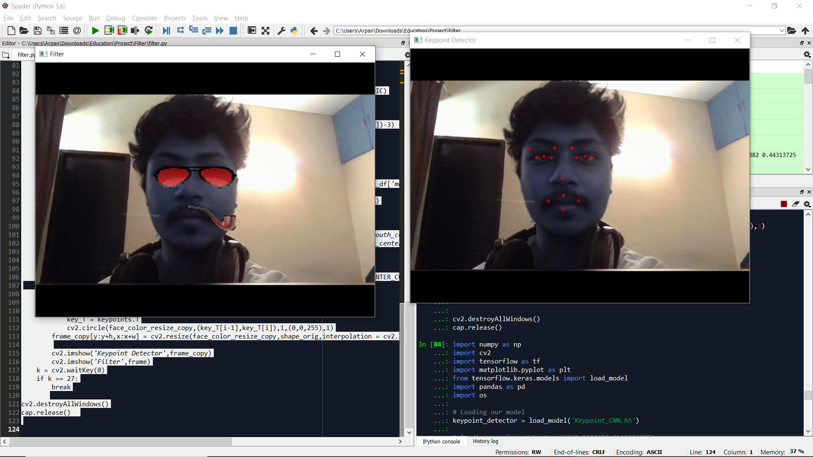

# Selfie-Filter-Project
<b> Creating Selfie Filters using facial keypoint detection and OpenCV </b>

### Methods Used
* Convolutional Neural Networks
* Deep Learning
* Visualisation
* Regression
* Statistics

### Technologies
* Python
* Pandas, Jupyter
* Numpy
* Keras
* OpenCV
* HAAR Cascade Classifier
* Matplotlib

## Description

* The aim of this project was to create selfie filters using facial keypoint detection.
* I have taken the data from Kaggle consisting of 7049 images with 15 keypoints per image.  
#### <b> Process </b>
* Using a Convolutional Neural Network Architecture inspired by the <i> NaimishNet </i> we predict the facial keypoints and save the model. The final model has a validation Mean Absolute Deviation of 1.28.
* Then with OpenCV we access our webcam and use HAAR Cascade Frontal Face classifier to detect the face in the frame.
* The detected face is pre-processed and fed into our saved model to get the keypoint coordinates.
* Using these keypoint coordinates we place our filter images. Here we have used 4 keypoints to achieve our desired result.
* The edited image is then shown in the Filter frame [Left]. The detected keypoints can be scene in the Keypoint Detector frame [Right].

## Credits
* Data Source: https://www.kaggle.com/c/facial-keypoints-detection/data
* CNN Architecture: https://arxiv.org/pdf/1710.00977.pdf
* HAAR Cascade Classifier Tutorial: https://www.youtube.com/watch?v=LopYA64KmdE

## Contact
* For any queries and feedback please contact me at mishraarpan6@gmail.com

Note: The project is only for education purposes, no plagiarism is intended.
